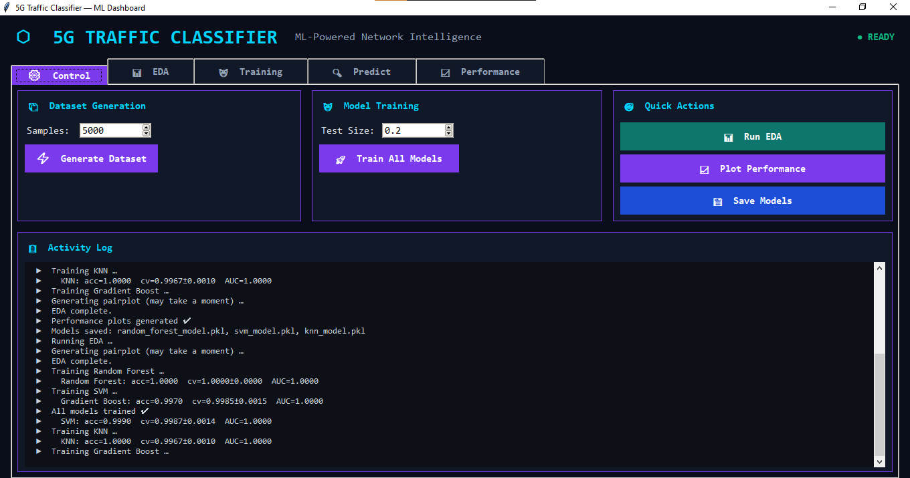
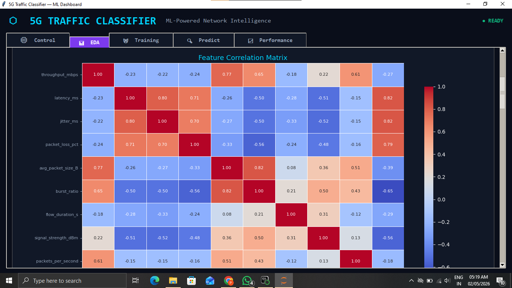
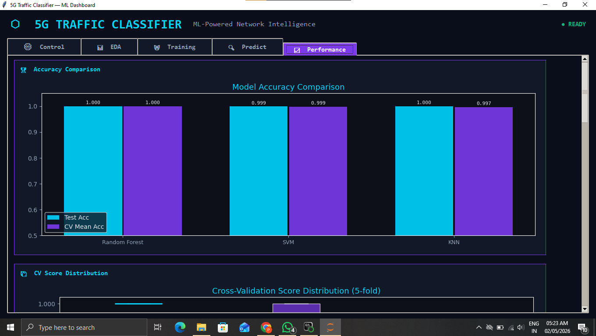
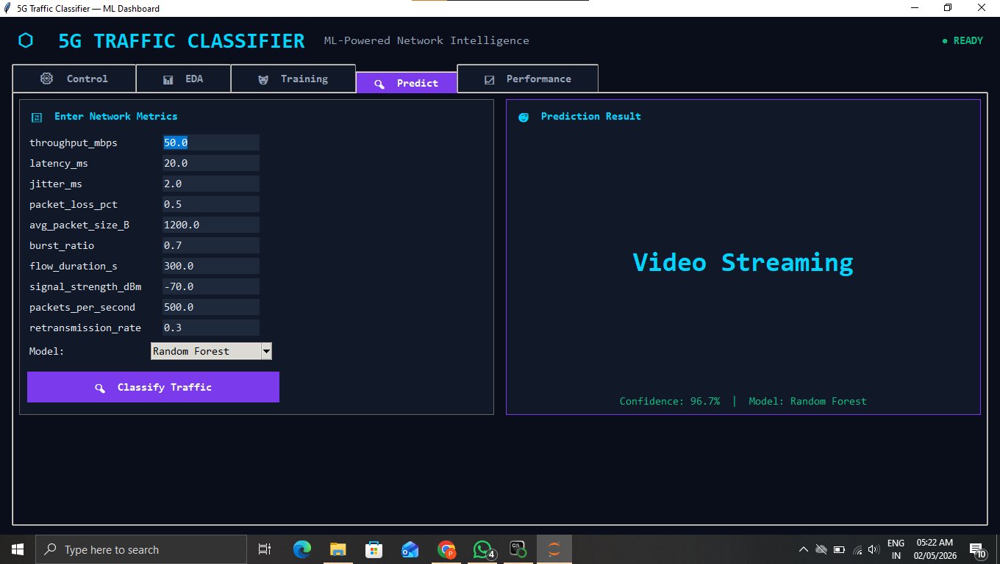

# 🚀 5G Network Traffic Classifier

This project focuses on implementing a Private 5G Network using Open5GS and UERANSIM along with a Machine Learning based Traffic Classifier.

---

## 📌 Project Overview

The project simulates a private 5G environment and analyzes network traffic using Machine Learning algorithms.

Traffic parameters collected:
- Throughput
- Latency
- Jitter
- Packet Loss
- Signal Strength

The collected data is used to classify network traffic patterns and evaluate network performance.

---

## 🛠️ Technologies Used

- Python
- Machine Learning
- Scikit-learn
- Pandas
- Open5GS
- UERANSIM
- Linux/Ubuntu

---

## ⚡ Features

- Private 5G Core setup
- UE and RAN simulation
- Traffic generation
- ML-based traffic classification
- Performance analysis

---

## 📂 Project Structure

```bash
5g-traffic-classifier/
│── 5g_traffic_classifier.py
│── 5g_network_traffic_dataset.csv
│── knn_model.pkl
│── svm_model.pkl
│── random_forest_model.pkl
│── gradient_boost_model.pkl
│── README.md
│── screenshots/
```

---

## 📸 Screenshots

### Traffic Classification Output


### Accuracy Graph


### Accuracy Graph


### Accuracy Graph


### Accuracy Graph


## 🎯 Future Enhancements

- Real-time traffic monitoring
- Deep Learning models
- Cloud-based deployment
- Live 5G traffic analysis

---

## 👩‍💻 Author

Pallavi K T
